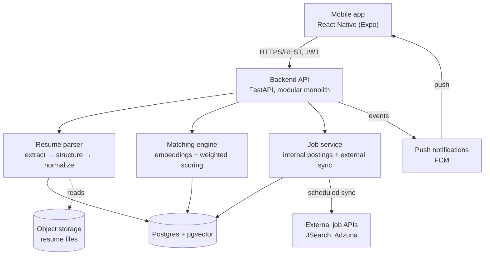
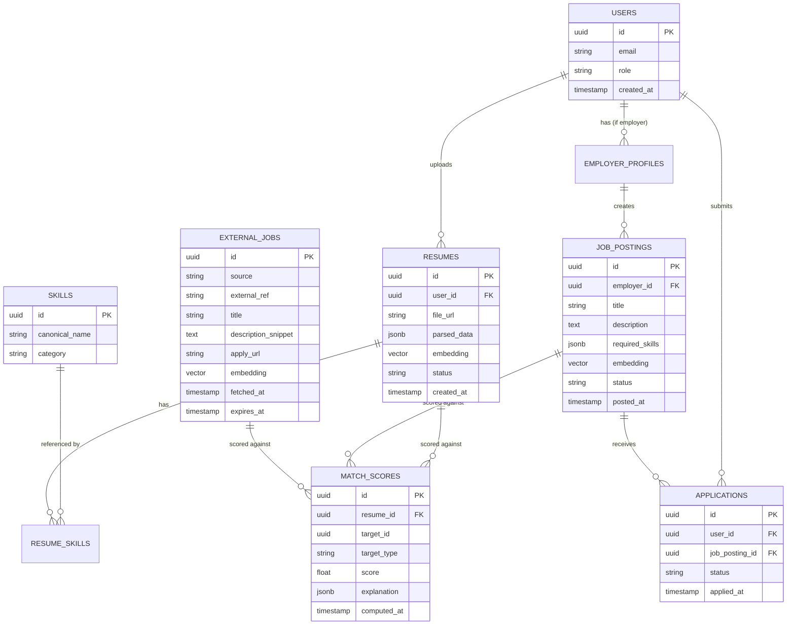

# SkillMatch AI — Technical Roadmap & Architecture Document

**Version:** 1.0
**Status:** Draft for team/adviser review
**Scope:** Mobile application (student + employer/OJT coordinator facing) with AI-based resume parsing and job/internship matching, sourcing opportunities both from postings inside the platform and from public job-search APIs outside the platform.

---

## 1. Executive summary

This document turns the SkillMatch AI proposal into an implementable system design. It recommends a concrete technology stack, a data model, an AI parsing/matching pipeline, an external job-sourcing strategy, and a phased delivery plan sized for a capstone/thesis timeline (roughly one term of active development, 16–20 weeks).

The guiding engineering principle throughout: **this is explicitly a pilot / proof-of-concept**, per the proposal's own scope section. Every recommendation below is chosen to get a working, defensible, evaluable system in front of a thesis panel and a small pilot user group — not to build a multi-tenant SaaS product. Where a "real production" version would differ, that is called out explicitly as future work (Section 15) rather than built now. This avoids both under-engineering (a toy that can't be evaluated) and over-engineering (infrastructure the team will spend more time operating than building on).

---

## 2. Requirements recap

Pulled directly from the proposal so implementation stays traceable to it.

**Functional**
- Resume upload (PDF/DOCX) and parsing into structured data: skills, education, experience.
- Job/internship posting management for employers/OJT coordinators.
- A matching/recommendation algorithm that scores and ranks postings against a resume.
- Recommendations must include postings **inside** the platform (employer/OJT-coordinator-created) and **outside** the platform (public job boards, via API).
- Student dashboard to track applications; employer dashboard to view ranked, shortlisted candidates.
- A way to evaluate matching accuracy/relevance against manual screening as a baseline.

**Explicitly out of scope (per the proposal)**
- Payroll, contract management, legal hiring compliance features.
- OCR for scanned/image resumes — text-based resumes only.
- Production-scale training data — this is a proof-of-concept matching model, evaluated on a pilot dataset.

**Non-functional (added — the proposal doesn't specify these, so they're assumptions)**
- Availability: best-effort during pilot; no 24/7 SLA required.
- Scale target for design purposes: a few hundred students, a few dozen employers/postings, low thousands of resume–job comparisons. Architecture should not *preclude* 10x growth, but should not be built for it on day one.
- Data privacy: resumes are personal data under the Philippine Data Privacy Act (RA 10173) — this materially affects storage, consent, and retention design (Section 9).

> **Assumption:** "inside the app" jobs are postings created by verified employers/OJT coordinators through the platform, and "outside the app" jobs are read-only listings pulled from a public job-search API and clearly labeled by source. If either of these differs from your intent, the data model in Section 5 and the sync design in Section 8 should be adjusted before implementation starts.

---

## 3. Key technical decisions

Each decision below is followed by the alternatives considered and why they were set aside. Full comparison tables are in the Appendix (Section 16).

### 3.1 Mobile client — React Native (Expo) + TypeScript

**Recommended.** A single JS/TS codebase covers Android and iOS, Expo removes most native-build friction (critical for a small student team without dedicated iOS/Android build infrastructure), and Expo's OTA updates let you push fixes during pilot testing without a new store submission. TypeScript catches an entire class of bugs (mismatched API shapes, undefined fields from a parsing service) before they reach a device.

- **Why not Flutter:** Comparable in capability; the deciding factor is ecosystem overlap with the backend. If the team's AI/NLP backend is Python (Section 3.2), a JS mobile layer keeps the team to two languages total instead of three, and JS/TS talent is generally easier to find among CS/IT undergrads than Dart.
- **Why not native (Kotlin/Swift separately):** Doubles the UI implementation work for no benefit at this stage; only justified once the app needs deep platform-specific capability (it doesn't — all the "AI" work is server-side).

### 3.2 Backend — Python, FastAPI, modular monolith

**Recommended.** The core differentiator of this system is NLP/ML (resume parsing, embeddings, similarity scoring). Python has the strongest ecosystem for that (spaCy, sentence-transformers, pdfplumber, python-docx). Rather than splitting a "business API" (Node) from an "ML service" (Python) — a common but premature pattern — build one FastAPI service with clear internal module boundaries (`services/resume_parser`, `services/matching`, `services/external_jobs`). This is a **modular monolith**: internally separated by responsibility, deployed as one unit.

- **Why not split into microservices now:** Two deployables, two sets of infra, network calls between them for what is currently low request volume — pure overhead for a pilot. The internal module boundaries are designed so a service *can* be extracted later (Section 15) if load genuinely requires it.
- **Why not Node/Express for everything:** Would require re-implementing or subprocess-calling Python for every NLP step, adding complexity instead of removing it.

### 3.3 Database — PostgreSQL + pgvector

**Recommended.** Relational integrity matters here (a student has many applications, an employer has many postings, an application references exactly one resume version and one posting) — this is not a document-shaped problem, so a NoSQL store would fight the domain. The `pgvector` extension lets resume/job embeddings live in the same database as everything else, with approximate-nearest-neighbor indexing (`ivfflat`/`hnsw`) available if the pilot dataset grows past brute-force-comparison size (roughly 50–100k vectors).

- **Why not a dedicated vector DB (Pinecone, Weaviate, Qdrant):** Adds a second system to run, back up, and pay for, to solve a scale problem this project doesn't have yet. `pgvector` handles the pilot's data volume comfortably.
- **Why not Firestore/MongoDB:** The core relationships (applications joining students, resumes, and postings; ranking queries that need to join structured fields with vector similarity) are naturally relational; a document store makes these joins harder, not easier.

### 3.4 Backend-as-a-service layer — Supabase (Postgres + Auth + Storage)

**Recommended, with a caveat.** Supabase bundles a managed Postgres (with `pgvector` available), authentication, and object storage on one free-tier-friendly platform. For a small team on an academic timeline, this removes weeks of infrastructure setup (auth flows, storage buckets, backups) without sacrificing anything you'll need for the pilot — Postgres is real Postgres, so you're not locked into a proprietary query layer.

- **Caveat:** the FastAPI backend still owns all AI/parsing/matching logic and all writes that need business-rule validation. Don't let the mobile app talk to Supabase directly for anything except reading its own already-authorized data and uploading files — resume parsing, matching, and anything touching external APIs must go through your backend so secrets stay server-side and business rules are enforced in one place (see Security, Section 9).
- **Why not Firebase:** Firestore's NoSQL model fights the relational data here (Section 3.3); Firebase's ecosystem is stronger for realtime sync than for the SQL-heavy scoring/ranking queries this project needs.
- **Why not self-hosted Postgres + custom auth from day one:** Viable, and worth revisiting for Section 15 (production hardening), but it's meaningfully more setup and ops burden for no pilot-stage benefit.

### 3.5 AI resume parsing — hybrid rule-based + LLM-assisted extraction

**Recommended.**

1. **Text extraction:** `pdfplumber` for PDF, `python-docx` for DOCX. (Scanned/image resumes are explicitly out of scope per the proposal — if a document fails text extraction, reject it with a clear message rather than silently failing.)
2. **Structured field extraction:** prompt an LLM (e.g., the Claude API) with the extracted raw text and a strict JSON schema (`skills[]`, `education[]`, `experience[]`, `certifications[]`) to return structured data, validated against the schema server-side before it's trusted (never execute or store anything an LLM returns without validation). This is more robust than hand-built regex/NER for messy, inconsistently-formatted student resumes, and is defensible in a thesis as "AI-based" extraction.
3. **Normalization against a controlled skills taxonomy:** map extracted skill strings to a pre-agreed skill list (per the proposal's own scope: "a defined and pre-agreed set of skill/keyword categories") using fuzzy string matching plus embedding similarity, so "ReactJS", "React.js", and "React" all resolve to one canonical skill. This step is what lets the matching engine do more than keyword search — directly addressing Problem Statement #4 in the proposal.
4. **Human-in-the-loop correction:** after parsing, show the student the extracted fields and let them edit before it's used for matching. This is cheap to build, meaningfully improves data quality, and gives you a second, very useful evaluation signal (edit rate = a proxy for parsing accuracy).

- **Why not a fully rule-based/NER pipeline:** Building and training a reliable custom NER model for resume fields is a multi-month effort by itself and is overkill for a proof-of-concept; a well-validated LLM extraction step gets comparable or better accuracy for a fraction of the engineering cost.
- **Why not LLM extraction with no validation layer:** LLMs occasionally hallucinate or misformat; the JSON schema validation step is non-negotiable — treat model output as untrusted input, same as any external API response.

### 3.6 Matching engine — weighted embedding similarity, explainable

**Recommended scoring model:**

```
match_score = 0.5 × skill_score + 0.3 × experience_score + 0.2 × education_score
```

- `skill_score`: cosine similarity between the resume's skill-set embedding and the posting's required-skill embedding, blended with an exact/fuzzy overlap ratio so exact matches are rewarded, not just "semantically close" ones.
- `experience_score`: cosine similarity between resume experience-description embeddings and the job description embedding, adjusted by years-of-experience vs. the posting's stated requirement.
- `education_score`: rule-based comparison against a simple education-level hierarchy (e.g., ongoing/undergraduate/graduate) plus field-of-study similarity.

Weights are configuration, not code — store them so they can be tuned during the evaluation phase (Section 12) without a redeploy.

**Explainability is a requirement, not a nice-to-have:** every match response should return which required skills matched, which are missing, and a one-line reason. This directly supports Objective 5 (evaluating relevance) and is a real usability win over "black box" percentage scores.

- **Why not pure TF-IDF/keyword matching:** This is exactly the "static keyword search" the proposal identifies as the problem with existing job boards (Problem Statement #4); it wouldn't differentiate the system at all.
- **Why not a learned ranking model (e.g., trained LTR/gradient-boosted ranker):** Needs labeled training data at a scale this pilot won't have. Revisit once the evaluation phase produces enough human-labeled comparisons (Section 12) — noted as future work in Section 15.

### 3.7 External ("outside the app") job sourcing

This needs the most caveats, so it gets its own subsection (Section 8) rather than a one-liner here. Short version: **JSearch (via RapidAPI/OpenWeb Ninja)** as the primary external source, with **Adzuna** as a secondary/future option, because of a real coverage gap explained below.

### 3.8 Auth, notifications, hosting

- **Auth:** Supabase Auth (email/password + optional school-domain restriction for students), with role claims (`student`, `employer`, `admin`) enforced server-side on every request — never trust a role claim from the client alone.
- **Push notifications:** Firebase Cloud Messaging (FCM) — works cleanly with Expo and is free at this scale.
- **Hosting (pilot budget):** backend on Render/Railway/Fly.io (free/low-cost tier, simple deploy from Git); Supabase's free tier for DB/Auth/Storage; Expo EAS Build for app binaries, distributed initially via TestFlight (iOS) and an internal testing track (Android) rather than a public store listing.
- **Background jobs:** a single scheduled worker (Python `APScheduler`, or a simple cron-triggered script) for syncing external job listings periodically. Not Celery+Redis yet — that's real infrastructure for a job that currently runs, at most, a few times a day.

---

## 4. System architecture



**Component responsibilities**

| Component | Responsibility | Notes |
|---|---|---|
| Mobile app | Auth, resume upload, browse/apply to recommendations, employer posting management, application tracking | Never calls external job APIs or LLM APIs directly — everything goes through the backend so API keys stay server-side |
| Backend API | Request validation, authorization, orchestration | One deployable; internal module boundaries mirror future service boundaries |
| Resume parser | Text extraction → LLM structuring → schema validation → skills normalization | Runs synchronously on upload for pilot scale; move to a background queue if upload volume or LLM latency makes that impractical |
| Matching engine | Embedding generation, scoring, ranking, explainability payload | Pure function of (resume, posting) → score; easy to unit test |
| Job service | CRUD for internal postings; scheduled sync + normalization of external postings into a common schema | External data is cached, not fetched per-request (Section 8) |
| Postgres + pgvector | System of record + vector similarity search | Single source of truth; row-level security scopes employer visibility to their own postings/applicants |
| Object storage | Raw resume files (PDF/DOCX) | Never stores extracted PII in filenames; access via signed URLs, not public buckets |

---

## 5. Data model



Notes:
- `EXTERNAL_JOBS` is a **cache table**, not a live pass-through — it has `fetched_at`/`expires_at` because external listings go stale and third-party quotas make live per-request calls impractical (Section 8).
- `MATCH_SCORES.target_type` (`internal` / `external`) plus `target_id` lets one table serve both recommendation types without a schema fork; the recommendation feed query is a straightforward `UNION` over both, ordered by score.
- A unique constraint on `(user_id, job_posting_id)` in `APPLICATIONS` prevents duplicate applications under concurrent requests — enforce this at the database level, not just in application code, since two near-simultaneous "apply" taps from the same device (or a retried request) must not create two rows.

---

## 6. Core workflows

**Resume upload & parsing**
1. Student uploads PDF/DOCX from the mobile app → backend validates file type by magic bytes (not just extension) and size limit.
2. File stored in object storage; backend extracts text.
3. Text sent to the LLM extraction step with the structured-output schema; response validated.
4. Skills normalized against the taxonomy; embeddings generated and stored.
5. Extracted data returned to the app for the student to review/correct before it's marked "active" and used for matching.

**Recommendation feed (the "inside + outside" requirement)**
1. App requests recommendations for the student's active resume.
2. Backend queries `MATCH_SCORES` for that resume across both `internal` and `external` targets (pre-computed on a schedule — see below — not computed live per request).
3. Results merged, sorted by score, each item tagged with its source and, for external items, the underlying board (e.g., "via LinkedIn, through JSearch") and a direct apply link.
4. Internal jobs support in-app application tracking; external jobs deep-link out and are marked "applied — tracked externally" if the student confirms they applied.

**Score computation is scheduled, not synchronous:** recomputing scores for every resume against every posting on every request doesn't scale and isn't necessary for freshness at this data volume. Recompute (a) whenever a resume is updated, (b) whenever a new posting/external job is ingested, and (c) on a periodic full refresh (e.g., nightly) to catch weight-tuning changes.

**Employer workflow:** post a job → view ranked, explained shortlist of internal applicants → update application status (which triggers a student-facing notification).

---

## 7. AI/NLP design detail

Already covered in 3.5/3.6 for the *what*; this section covers evaluation, which is Objective 5 of the proposal and deserves explicit methodology since "the AI works" is not a claim a thesis panel will accept without evidence.

**Proposed evaluation method**
1. Collect a sample of real (consented, anonymized where possible) resumes and postings from the pilot dataset (school OJT office partnership, per the proposal's own scope).
2. Have 2–3 human raters (e.g., OJT coordinators) independently rank a shortlist of candidates per posting, blind to the AI's ranking.
3. Compare AI ranking to the human-rated ranking using:
   - **Precision@k / Recall@k** (does the AI's top-5 overlap with the humans' top-5?)
   - **NDCG@k** (does it get the *order* right, not just the set?)
   - Inter-rater agreement among the humans themselves, as a baseline — if humans disagree with each other by X%, the AI can't reasonably be held to a stricter standard than that.
4. Report both the quantitative metrics and qualitative notes on where the AI over/under-weighted skills vs. experience vs. education, which is directly useful for tuning the weights in Section 3.6.

This gives the thesis a real "Results" chapter instead of an anecdotal "it seemed to work" claim.

---

## 8. External job sourcing — detailed plan

This is the section most likely to surprise the team, so it's worth being precise.

| Option | Coverage | Cost | Notes |
|---|---|---|---|
| **Adzuna API** | 18 countries — US, UK, Canada, Australia, most of Western Europe, India, Brazil, Mexico, Singapore, South Africa, etc. **Does not currently cover the Philippines.** | Free tier (~1,000 calls/month), official documented REST API | Good, well-documented API; simply not usable as the *primary* source for a Philippines-based pilot given the country gap |
| **JSearch (RapidAPI / OpenWeb Ninja)** | Aggregates via Google for Jobs across LinkedIn, Indeed, Glassdoor, ZipRecruiter, and others; location is a free-text query parameter, so Philippines-located searches return results, but coverage of *local* PH boards (JobStreet, Kalibrr) depends on what Google for Jobs has indexed and is not guaranteed comprehensive | Free tier (~200 requests), paid tiers scale by volume | **Recommended primary source.** Do a short technical spike early (Phase 0) pulling real queries for PH locations/roles before committing further — validate actual result quality and volume, don't assume it from documentation |
| **Direct partnership feed (school OJT office / partner employers)** | As good as the partnership | Free | The proposal already scopes this ("partnering with the school's OJT office"). This is the most reliable channel for *locally relevant* opportunities and should not be dropped even once an API is wired up — treat it as a complementary source, not a fallback |
| **Scraping JobStreet/Kalibrr/LinkedIn/Indeed PH directly** | Full, if it worked | Free but high legal/technical risk | **Not recommended.** These sites' terms of service generally prohibit scraping; this is a real legal exposure for a school project with the institution's name attached, independent of the technical fragility of scrapers |

**Sync design**
- A scheduled worker calls JSearch (and, if later expanded internationally, Adzuna) for a curated set of queries (e.g., per common OJT/entry-level role categories relevant to the school's programs), on a cadence of a few times a day — not per user request. This respects the free-tier rate limit and keeps external-API dependency off the request path a student is waiting on.
- Results are normalized into the `EXTERNAL_JOBS` schema (Section 5), deduplicated (`source` + `external_ref`), and given an `expires_at` so stale listings age out of recommendations.
- **Graceful degradation:** if the external API is down or quota-exhausted, the recommendation feed simply falls back to internal-only results with no error surfaced to the student — external sourcing should never be a single point of failure for the core feature.
- All external calls happen server-side; API keys for JSearch/Adzuna live in backend environment variables, never in the mobile app bundle.

---

## 9. Security & compliance considerations

- **Data Privacy Act of 2012 (RA 10173):** resumes contain personal, and sometimes sensitive, personal information (PH resumes commonly include birthdate, civil status, sometimes a photo). Collect only what matching requires; if the parsing step extracts fields like birthdate that aren't used for scoring, don't persist them. Capture explicit consent at upload time, define a data retention/deletion policy (e.g., resumes deleted N months after a student graduates or on request), and be able to honor a deletion request end-to-end (file storage + DB + any cached embeddings).
- **File upload safety:** validate MIME type by magic bytes, enforce a max file size, and run parsing in a resource/time-limited context — untrusted PDFs and DOCX files are a known vector for parser exploits (zip bombs, malformed structures that hang a parser).
- **Authorization, not just authentication:** every endpoint re-validates role and ownership server-side (a student can only ever fetch their own resume/applications; an employer can only ever see applicants to their own postings) — enforce this with Postgres row-level security in addition to application-layer checks, so a bug in one layer doesn't expose the other.
- **Secrets management:** LLM API keys, JSearch/Adzuna keys, FCM server key — all server-side environment variables, never shipped in the mobile bundle or logged.
- **Rate limiting:** on resume upload and any endpoint that triggers an external API call, to prevent both abuse and accidental quota exhaustion of the free-tier external APIs.
- **SSRF awareness:** if the backend ever fetches a URL supplied by external job data (e.g., to prefetch a full description), validate/allowlist before fetching — don't let a malicious or malformed `apply_url` cause the backend to make arbitrary outbound requests.
- **Transport/storage:** HTTPS everywhere (default with the recommended hosting), encryption at rest (default with Supabase-managed Postgres/Storage).

---

## 10. Non-functional requirements addressed

| Concern | Pilot-scale approach | 10x scenario |
|---|---|---|
| Performance | Synchronous parsing acceptable (seconds); pre-computed match scores make the feed a simple indexed query | Move parsing to a background queue if upload volume grows; `pgvector` ANN indexing already in place |
| Scalability | Single backend instance is sufficient | Horizontal scaling of the (stateless) API; the real bottleneck at scale is external API quotas, not compute — the caching design in Section 8 already accounts for this |
| Availability | Best-effort; no on-call rotation needed | Add health checks + basic uptime monitoring before any real production commitment |
| Observability | Structured (JSON) logs + a free-tier error tracker (e.g., Sentry) are enough to debug the pilot | Add request tracing/metrics dashboards once there's real on-call ownership |
| Maintainability | Modular monolith with clear internal boundaries (Section 3.2) is deliberately chosen so this doesn't need a rewrite to scale — it needs extraction, not redesign |

---

## 11. Proposed repository structure

```
mobile/                          # React Native (Expo) + TypeScript
  src/
    api/                         # typed API client
    navigation/
    screens/
      auth/
      resume/                    # upload, review/correct parsed data
      jobs/                      # recommendation feed (internal + external, source-tagged)
      applications/              # tracker
      employer/                  # posting management, ranked applicant view
    components/
    hooks/
    store/                       # React Query for server state; Zustand/Context for local UI state
    types/
  app.json
  eas.json

backend/                         # Python, FastAPI
  app/
    main.py
    api/v1/
      auth.py
      resumes.py
      jobs.py
      applications.py
      matches.py
      external_jobs.py
    core/                        # config, security, dependency injection
    models/                      # SQLAlchemy ORM models
    schemas/                     # Pydantic request/response schemas
    services/
      resume_parser/             # pdf_extractor.py, docx_extractor.py, field_extractor.py, skills_taxonomy.py
      matching/                  # embedding_service.py, scorer.py
      external_jobs/             # jsearch_client.py, adzuna_client.py, sync_worker.py, normalizer.py
      notifications/             # fcm_client.py
    db/                          # session management
    workers/                     # scheduled sync jobs
    tests/
      unit/
      integration/
  alembic/                       # DB migrations
  requirements.txt
```

---

## 12. Phased delivery roadmap

Sized for a ~5-month capstone development window; adjust to your actual academic calendar. Each phase lists an exit criterion — a concrete, checkable "done" condition, not just a task list.

| Phase | Focus | Duration | Exit criteria |
|---|---|---|---|
| **0 — Discovery & setup** | Finalize skills taxonomy; gather sample resumes/postings (with consent) from the OJT office; wireframes for core screens; provision Supabase/Expo/repo/CI; **JSearch PH coverage spike** | 2 weeks | Team can point to 20+ real sample resumes and postings; JSearch spike has real PH query results reviewed |
| **1 — Foundations** | Auth (student/employer/admin roles), resume upload + storage, basic profile screens, backend skeleton + migrations | 3 weeks | A student can sign up, log in, and upload a resume file that lands in storage with a DB row |
| **2 — AI parsing & internal matching MVP** | Extraction pipeline, skills normalization, embeddings, internal job CRUD, matching endpoint + explainability, mobile screens for upload review + feed | 4 weeks | A student uploads a resume and sees a ranked, explained list of internal postings |
| **3 — External job integration** | JSearch client, sync worker, normalization into `EXTERNAL_JOBS`, merged feed with source labeling, graceful degradation | 3 weeks | Feed shows both internal and external results, clearly labeled, even with the external API artificially disabled |
| **4 — Employer experience & tracking** | Employer posting management, ranked applicant dashboard, student application tracker, push notifications | 3 weeks | An employer can post a job, see ranked applicants, and change a status that notifies the student |
| **5 — Evaluation & hardening** | Run the evaluation methodology (Section 7), security review (Section 9 checklist), bug bash, demo build | 3 weeks | Evaluation metrics (precision@k, NDCG@k, inter-rater baseline) are computed and written up |
| **6 — Future work (post-thesis)** | Production hardening — see Section 15 | — | Not required for thesis defense |

---

## 13. Risk register

| Risk | Likelihood | Impact | Mitigation |
|---|---|---|---|
| LLM-based extraction is inaccurate on messy/inconsistent resume formats | Medium | High | Human-in-the-loop correction step (3.5) both fixes the immediate issue and produces a data-quality signal for the thesis |
| JSearch's Philippines coverage turns out to be thin | Medium | Medium | Phase 0 spike catches this early; the OJT-office partner feed (Section 8) is a real fallback that doesn't depend on the API at all |
| Pilot dataset too small for statistically meaningful evaluation | Medium | High | Design the evaluation (Section 7) to report both quantitative metrics and qualitative analysis, so a small-N result is still a defensible thesis contribution |
| Scope creep toward "real production app" | High | Medium | This document's phased plan deliberately excludes production concerns until Section 15; revisit only after Phase 5 |
| Resume PII handling exposes the team/school to a Data Privacy Act issue | Low | High | Minimize collected fields, get explicit consent, have a real deletion path (Section 9) — don't defer this to "later" |
| Mobile app store review delays (if a public release is attempted) | Medium | Low | Use TestFlight/internal testing tracks for pilot and thesis defense; public store listing is out of scope for the thesis timeline |

---

## 14. Testing strategy

- **Unit tests:** extraction functions against fixture resumes (empty resume, no-skills-section resume, resume with an unusual layout); scoring functions against edge cases (zero required skills, zero resume skills, tie-breaking).
- **Integration tests:** FastAPI `TestClient` covering auth flows and role-based authorization (a student token must not be able to read another student's resume; an employer token must not see another employer's applicants).
- **Contract tests for the external API client:** mock the HTTP layer — CI must never call the real JSearch/Adzuna endpoints and consume the free-tier quota.
- **Mobile tests:** component tests (Jest + React Native Testing Library) for the resume-review and feed screens; a small number of end-to-end tests (Detox or Maestro) for the critical path: sign up → upload → view feed → apply.
- **Regression tests:** whenever a parsing or scoring bug is found during the pilot, add the specific input that triggered it as a fixture before fixing it.

---

## 15. Future work / production hardening (explicitly out of scope for now)

Listed so the team can distinguish "we chose not to build this yet" from "we forgot":
- Extract the resume-parsing/matching services into an independently scalable service if request volume genuinely requires it.
- Move from a scheduled `APScheduler` sync to a proper task queue (Celery/Redis or similar) if the number of external sources or sync frequency grows.
- Add a trained learning-to-rank model once the evaluation phase has produced enough labeled comparisons to train on.
- Multi-tenant support if more than one school wants to use the platform.
- Public app store listings, with the associated compliance review (data safety forms, etc.).
- CI/CD pipelines with automated deploys, and a real monitoring/alerting stack.
- Formal accessibility audit of the mobile app.

---

## 16. Appendix: alternatives considered

| Decision | Chosen | Rejected | Why rejected |
|---|---|---|---|
| Mobile framework | React Native + Expo | Flutter | No decisive advantage here; JS/TS keeps the team to two languages when paired with a Python backend |
| | | Native (Kotlin/Swift) | Doubles UI work; no native-only capability is needed |
| Backend language | Python (FastAPI) | Node.js | Python's NLP/ML ecosystem is the deciding factor for this domain |
| Backend architecture | Modular monolith | Microservices | Premature at this scale; adds ops overhead without a corresponding benefit |
| Database | Postgres + pgvector | MongoDB/Firestore | Data is inherently relational (users, resumes, postings, applications) |
| | | Dedicated vector DB | Solves a scale problem this pilot doesn't have |
| Matching approach | Weighted embedding similarity | Pure TF-IDF/keyword | Reproduces exactly the "static keyword search" limitation the proposal identifies as the problem |
| | | Trained learning-to-rank model | No labeled training data yet; revisit post-evaluation (Section 15) |
| External job source | JSearch (primary) | Adzuna (primary) | Adzuna does not currently cover the Philippines |
| | | Scraping job boards directly | Terms-of-service and legal risk, independent of technical fragility |

---

## 17. Open questions for the team/adviser

1. Will the same mobile app serve employers/OJT coordinators (role-based views), or should employers get a separate lightweight web dashboard instead? This roadmap assumes one app with role-based views; a web dashboard is a reasonable alternative if employer users are expected to work primarily from a desktop.
2. What is the actual consent/data-sharing agreement with the school's OJT office for using real student resumes in the pilot dataset and evaluation?
3. Is a public app store release in scope at all for the thesis, or is TestFlight/internal-track distribution sufficient for the defense?

---

*Once this direction is reviewed and approved, the natural next step is a starter codebase (backend skeleton with the module structure in Section 11, plus the mobile app's navigation shell and auth screens) implementing Phase 1 of the roadmap above.*
